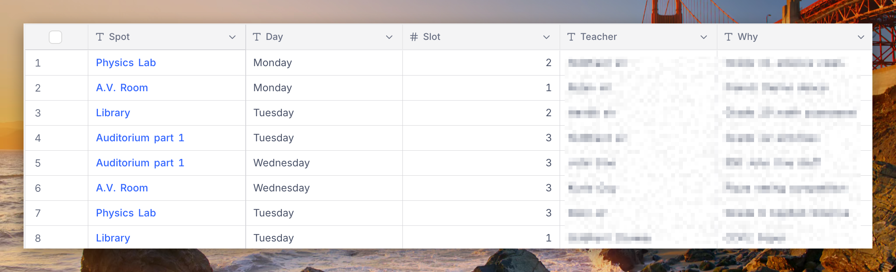
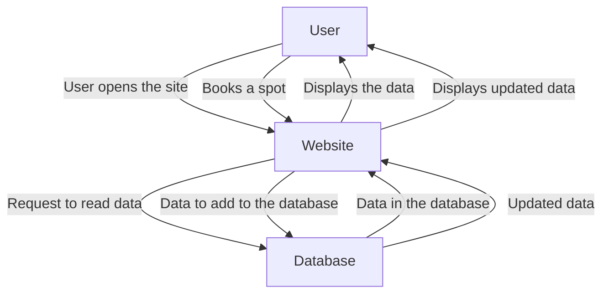

# Booking site for the teachers of MGIS

*Originally meant for the use of the teachers of MGIS*

## About

This is a simple booking site for teachers in which they can book spots for their next session or class and pick the day and time slot for which they need the spot. The fact that you can only pick a spot based on the days of the week and not the month is intentional and prevents teachers from booking spots way too many days in advance. It uses [NocoDB](https://nocodb.com) for the backend and vanilla JavaScript, HTML and CSS for the frontend. Due to its simple nature, there is no authorisation or login flow, nor are there any cancellation options. However, these may get added in the future.

## Use it for your own project

You can use it for your own project without even cloning the repository locally. 
These steps show how to host it on [Vercel](https://vercel.com) with [NocoDB](https://nocodb.com) as a database for free.

### Steps:

1. Star and fork this repository

#### Database setup

2. Sign up to [NocoDB](https://nocodb.com) if you haven't already and create a new database
3. Create a new table in that base called `booking_data_main`
4. Create 5 columns in the table, each named exactly:

  - Spot
  - Day
  - Slot
  - Teacher
  - Why

It should look something like the following (without the data):

5. Make sure you have added them in the correct order
6. Make sure `Slot` is set to type `Number` in the dropdown and all others are set to type `Single line text`

#### Hosting

7. Sign up to [Vercel](https://vercel.com) if you haven't already
8. Connect your GitHub account
9. Create a new project and select the forked repository
10. In environment variables, add:

| Environment variable | What to put | Why | Get it from |
| :------------------: | :---------: | :-: | :---------: |
| `NOCODB_API_BASE_URL` | The base url of your database | This tells the website where yor database lives | Open your database in a browser and copy the link |
| `NOCODB_VIEW_ID` | The view ID of your database | To ensure the data is correctly formatted | Above your table, there is "Colour"; next to it, there are three dots. Click that, and you will see a dropdown with your view ID |
| `NOCODB_API_TOKEN` | The API key | To tell NocoDB the website is allowed to edit and read from the database | Make a new one from [here](https://app.nocodb.com/account/tokens) and make sure records permission is set to `read & write` |

11. Click `Publish site` or similar, and your site will be live.

## Structure

## License

Licensed under the AGPL-3.0 license. Free to use, modify and redistribute, however, all modifications and replicas of the original codebase must be icensed under the same license. Refer to [LICENSE](LICENSE) for more details.
